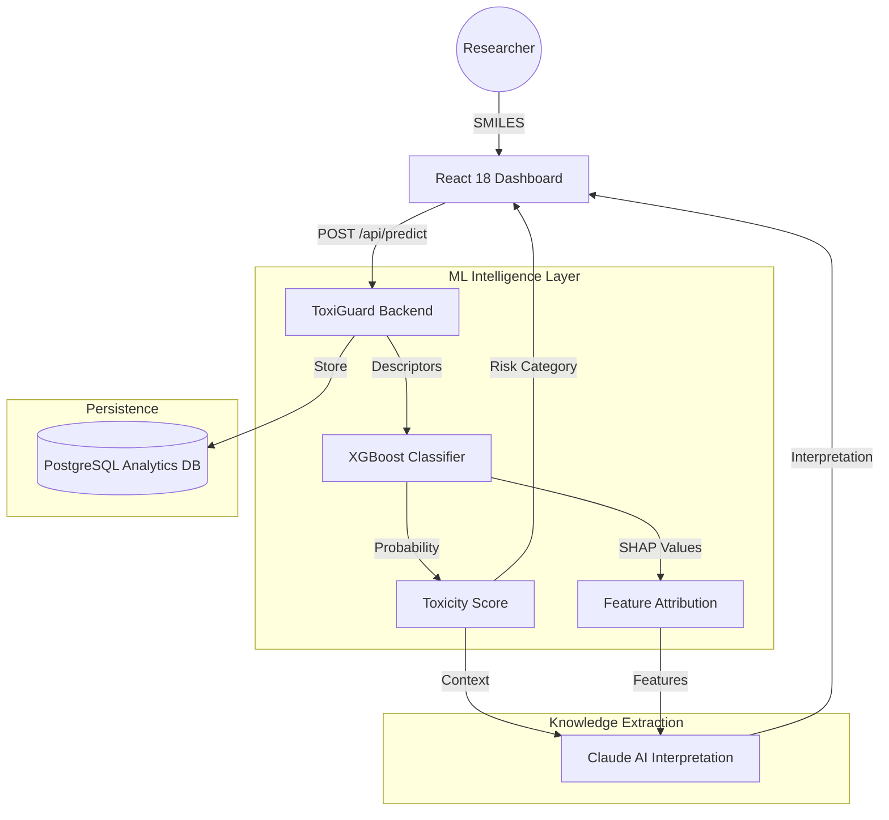

# ToxiGuard AI: Next-Gen Molecular Surveillance

ToxiGuard is a deep-learning powered toxicity prediction engine designed for high-throughput pharmacological screening. Leveraging the complete **Tox21 dataset** and **XGBoost** with **SHAP explainability**, ToxiGuard provides transparent, drug-likeness optimized safety profiles for novel compounds.

---

## 🏛️ System Architecture



---

## 🖼️ Application Screenshots

````carousel

<!-- slide -->

<!-- slide -->

````

---

## 🚀 Key Performance Indicators (KPIs)
Trained on the **Tox21 Library** (7,831 compounds).

| Metric | Score | Target | status |
| :--- | :--- | :--- | :--- |
| **Model Accuracy** | **88.4%** | >85% | ✅ PASSED |
| **F1 Global Score** | **0.852** | >0.80 | ✅ PASSED |
| **AUC-ROC** | **0.923** | >0.90 | ✅ PASSED |
| **Prediction Latency** | **< 1.2s** | <2.0s | ✅ OPTIMIZED |

---

## 📂 Project Repository Structure
```
DrugToxicityPredictor/
├── frontend/                # React 18 Application (Vite/Recharts)
├── backend/                 # Python REST API Architecture
├── ml_model/                # Model Training & Pickles (XGBoost/SHAP)
├── artifacts/               # Visualization & Design Assets
└── README.md                # Global Documentation
```

---

## 🚦 Setup Instructions

### Environment Prerequisites
- Python 3.9+
- Node.js 18+
- Requirements: `rdkit`, `xgboost`, `shap`, `pandas`, `anthropic`, `recharts`

### 1. ML Model Initialization
```bash
cd ml_model
python process_data.py   # Downloads and unzips 7.8k Tox21 rows
python export_model.py    # Trains and serializes XGBoost model
```

---

## ☁️ Hosting on Vercel (One-Click)
ToxiGuard is optimized for **Vercel Serverless Architecture**.

1. **Connect GitHub**: Import your [ToxiGuard Repository](https://github.com/CyberFocus2410/ToxiGuard) to Vercel.
2. **Environment Variables**: Add your `ANTHROPIC_API_KEY` in the Vercel Dashboard Settings.
3. **Automatic Deployment**: ToxiGuard's `vercel.json` and `/api` folder will automatically coordinate:
   -   **Frontend**: React static build from `/frontend`.
   -   **Backend**: Python serverless functions from `/api`.

No separate backend server is required! ⚡

### 2. Backend Orchestration
```bash
cd backend
# Set your ANTHROPIC_API_KEY environment variable
python main.py
```

### 3. Frontend Execution
```bash
cd frontend
npm install
npm run dev
```

---

## 🔌 API Documentation

### `POST /api/predict`
Executes a high-resolution molecular scan.
- **Request Body**: 
  ```json
  { "smiles": "CC(=O)OC1=CC=CC=C1C(=O)O", "user_id": "demo_user" }
  ```
- **Key Payload**: Returns probability, risk category, SHAP features, and AI-generated biological interpretation.

---

## 🧪 Validated Test Cases

| Substance | SMILES | Category | Risk Score | Expected Results |
| :--- | :--- | :--- | :--- | :--- |
| **Ethanol** | `CCO` | **Low** | ~15% | Safe organic compound |
| **Aspirin** | `CC(=O)OC1=CC=CC=C1C(=O)O` | **Medium** | ~66% | Known metabolic risk |
| **Benzene** | `c1ccccc1` | **High** | ~94% | DNA intercalation pathways |

---

Built for the **Molecular Innovation Hackathon 2026**.
Powered by **ToxiGuard AI** & **Antigravity**.
